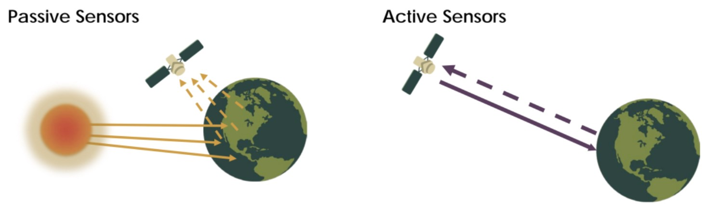
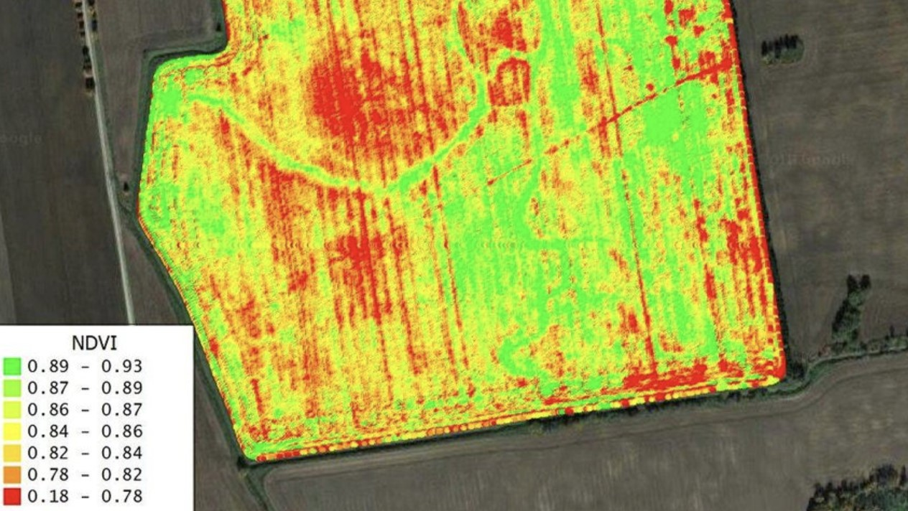
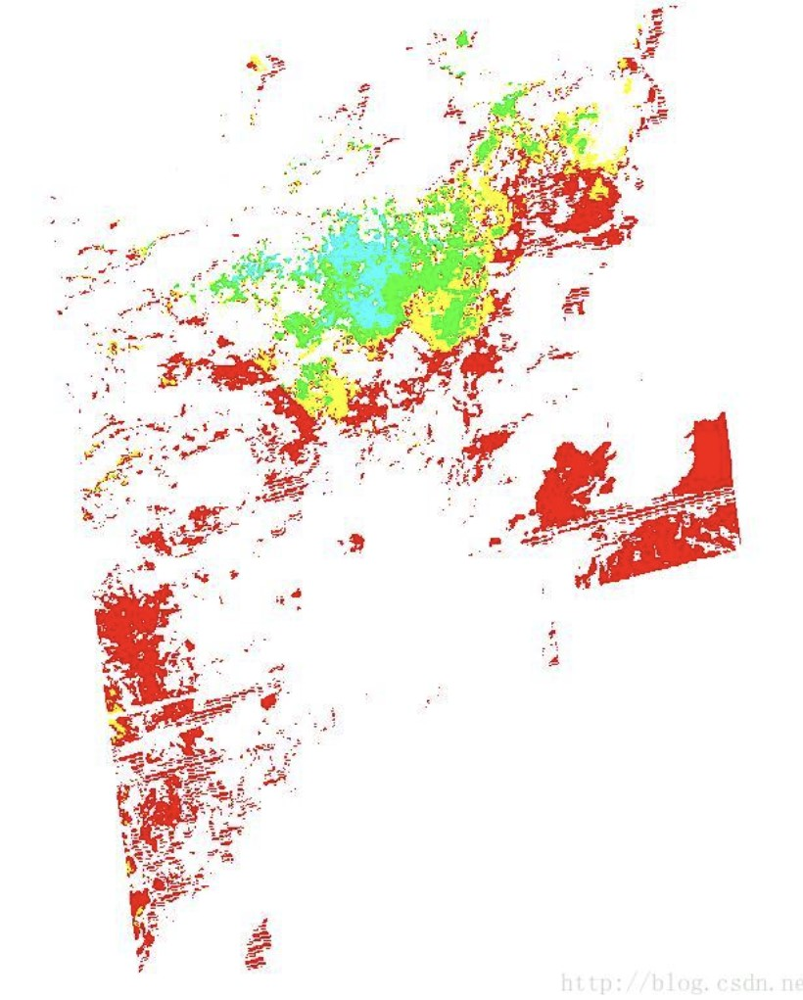

# What is sensor?
- Remote sensing sensors are instruments on satellites and aircraft that use the sun as a lighting source or provide their own lighting source to measure the energy reflected back. 

- Sensors that use natural energy from the sun are called passive sensors; Sensors that use their own energy are called active sensors.


```{r echo=FALSE, out.width='100%', fig.align='center'}

```

---
# An example of sensor: MODIS

- MODIS stands for Moderate Resolution Imaging Spectroradiometer.

- It is aboard the EOS (Earth Observation System) satellites Terra and Aqua.

- MODIS is an optical remote sensing instrument with 36 discrete spectral bands, covering the spectral range from 0.4 microns (visible light) to 14.4 microns (thermal infrared).

- MODIS multi-band data can simultaneously reflect land surface conditions, cloud boundaries, cloud characteristics, ocean water color, phytoplankton, biogeography, chemistry, atmospheric water vapor, aerosols, surface temperature, cloud top temperature, atmospheric temperature, ozone and cloud top height.

- The MODIS instrument has ground resolutions of 250m, 500m and 1000m.<sup>1</sup>

.footnote[
[1] A resolution of 1000m means each pixel represents a 1000 m x 1000m area on the ground.
]

---
# Application of MODIS data: NDVI

- NDVI is an important parameter that can reflect plant physiology and ecology on a macro scale.

```{r echo=FALSE, out.width='80%', fig.align='center'}

```

---
# Application of MODIS data: Surface temperature inversion

- Using MODIS thermal infrared band, the land surface temperature can be retrieved by split-window algorithm. Including temperature anomalies and forest fire products.

```{r echo=FALSE, out.width='40%', fig.align='center'}
knitr::include_graphics('img/surface temperature.jpg')
```

---
# Application of MODIS data: Optical aerosol thickness inversion

- MODIS products are used to perform optical aerosol (AOD) inversion and then PM2.5 inversion.

```{r echo=FALSE, out.width='40%', fig.align='center'}

```

---
# Reference

Earthdata (nd.) What is Remote Sensing? Available at: https://www.earthdata.nasa.gov/learn/backgrounders/remote-sensing

Fat eagle (2017) Introduction and download of MODIS data. Available at:
https://blog.csdn.net/ESA_DSQ/article/details/70080617

Shurlaeva, Ekaterina & Tokarev, K & Sanzhapov, B. (2021). Satellite monitoring and visualization of vegetation indices for assessing crop productivity. Journal of Physics: Conference Series. doi: 10.1088/1742-6596/2060/1/012018. 


---

class: center, middle

# Thanks!

